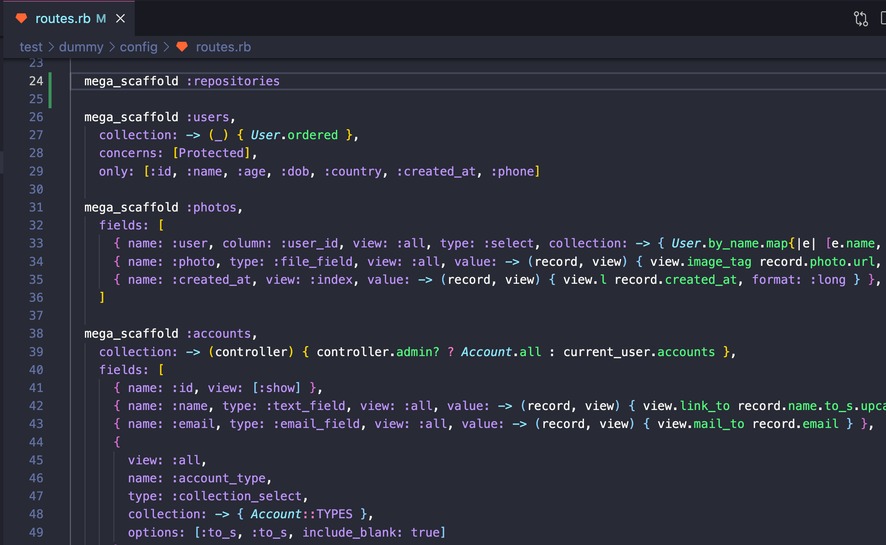
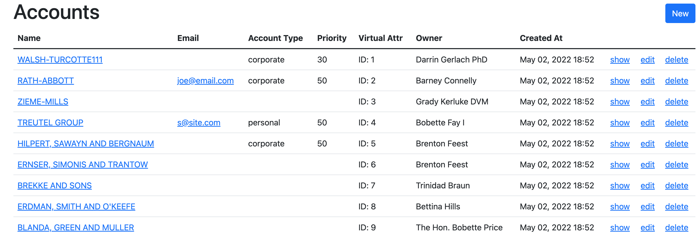
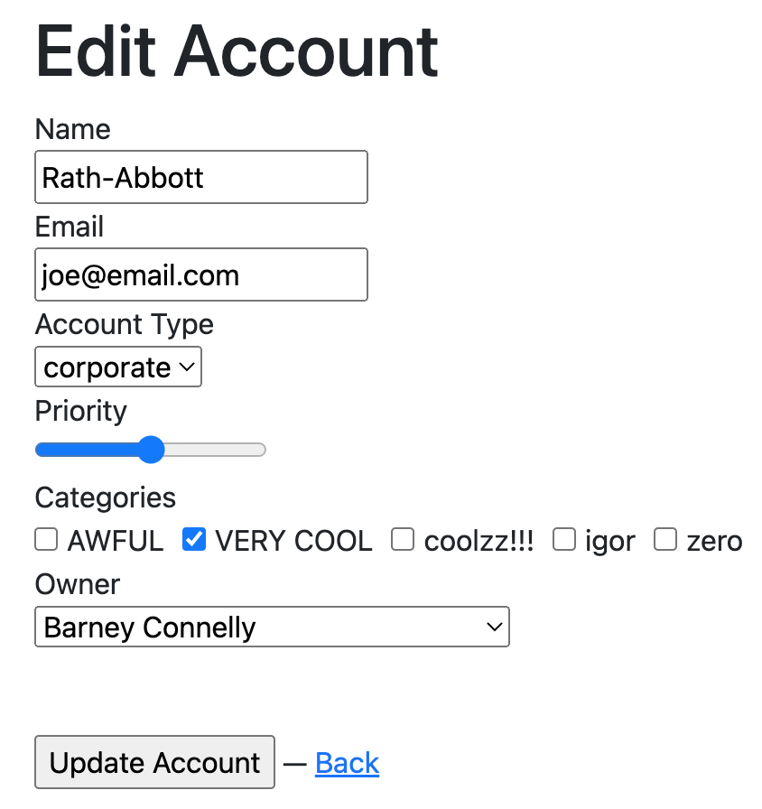

# mega_scaffold

[](https://www.railsjazz.com)

This is the FASTEST way how to add CRUD functionality for your models. Literally by just adding ONE LINE of code in `routes.rb`.

With additional customization options it allows you to build quickly admin panels or simple controllers to output data.

It works with existing models so all your validations, associations, etc will work as usual.



## Usage

1) add gem to Gemfile `gem "mega_scaffold"`

2) open `routes.rb`

3) add `mega_scaffold :categories` (if you have `Category` model)


## Customization

- configure layout
- specify how to fetch records
- specify type for input
- configure to work with associations
- access helpers to output value
- hide columns
- change labels
- specify which fields where to show
- provide additional options for form fields

How CRUD looks - simple but created in 2 minutes:




If you need examples of customization (see `test/dummy` as an example):

```ruby
# routes.rb

Rails.application.routes.draw do

  # could be nested in existing resources
  resources :companies do
    mega_scaffold :attachments,
      parent: -> (controller) { Company.find(controller.params[:company_id]) },
      collection: -> (controller) { controller.parent.attachments },
      fields: [
        { name: :id, view: :index },
        { name: :file, type: :file_field, view: :all, value: -> (record, view) { view.link_to 'Download', record.file.url } },
        { name: :created_at, view: :index },
      ]
  end

  # could be added to namespaces
  namespace :secret do
    namespace :admin do
      mega_scaffold :categories, fields: [
        { name: :id, view: :index },
        { name: :name, view: :all, value: -> (record, _) { record.name&.upcase } },
        { name: :accounts, view: [:index, :show], value: -> (record, _) { record.accounts.count } },
        { name: :created_at, view: [:index, :show], value: -> (record, _) { I18n.l record.created_at, format: :short } },
      ]
    end
  end

  # simple usage, you can specify concerns with "before_action" or other contoller-related logic
  mega_scaffold :users,
    collection: -> (_) { User.ordered },
    concerns: [Protected],
    layout: 'admin',
    only: [:id, :name, :age, :dob, :country, :created_at, :phone]

  # usage with file upload and showing images in the index and show views
  mega_scaffold :photos,
    fields: [
      { name: :user, column: :user_id, view: :all, type: :select, collection: -> { User.by_name.map{|e| [e.name, e.id]} }, value: -> (record, view) { view.link_to_if record.user, record.user&.name, record.user } },
      { name: :photo, type: :file_field, view: :all, value: -> (record, view) { view.image_tag record.photo.url, style: 'width: 200px' } },
      { name: :created_at, view: :index, value: -> (record, view) { view.l record.created_at, format: :long } },
    ]

  # access to different set of records (for example admin can see all records and all other users only own) + form with associations
  mega_scaffold :accounts, 
    collection: -> (controller) { controller.admin? ? Account.all : current_user.accounts },
    fields: [
      { name: :id, view: [:show] },
      { name: :name, type: :text_field, view: :all, value: -> (record, view) { view.link_to record.name.to_s.upcase, record } },
      {
        view: :all,
        name: :account_type,
        type: :collection_select,
        collection: -> { Account::TYPES },
        options: [:to_s, :to_s, include_blank: true]
      },
      {
        view: :all,
        name: :priority,
        type: :range_field,
        options: { min: 0, max: 100, step: 10 }
      },
      { 
        name: :categories,
        column: {
          name: :category_ids,
          permit: [],
        },
        type: :collection_check_boxes,
        options: [:id, :name],
        view: :form,
        collection: -> { Category.by_name },
        value: {
          index: -> (record, _) { record.categories.count },
          show: -> (record, _) { record.categories.pluck(:name).join(", ") }
        }
      },
      { name: 'VIRTUAL ATTR', type: :virtual, view: :index, value: -> (record, view) { "ID: #{record.id}" } },
      {
        name: :owner_id,
        label: "Owner",
        view: :all,
        options: { include_blank: true },
        type: :select,
        collection: -> { User.by_name.map{|e| [e.name, e.id]} },
        value: -> (record, _) { record.owner&.name }
      },
      { name: :created_at, view: [:index, :show], value: -> (record, _) { I18n.l(record.created_at, format: :long) } },
    ]
 end
```

## TODO Ideas

- config for actions
- more specs
- simple search using ransack?
- how to overide view instructions
- check if all is ok with turbo/turbolinks
- export to CSV, JSON?
- integration with pundit or cancancan?
- support for "resource" type
- work with I18n to translate labels?
- how to customize views
- view customization per controller
- refactor how controller is generated on the fly (combine into one file)

## Contributing

You are welcome to contribute.

## License
The gem is available as open source under the terms of the [MIT License](https://opensource.org/licenses/MIT).
